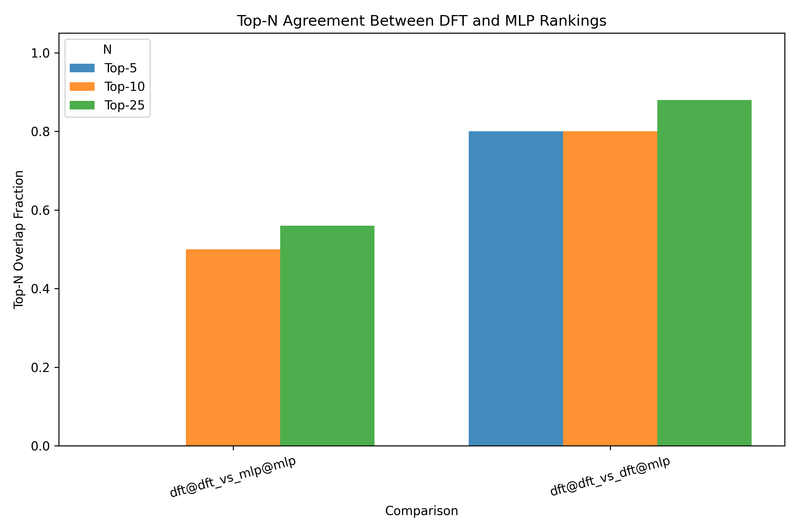
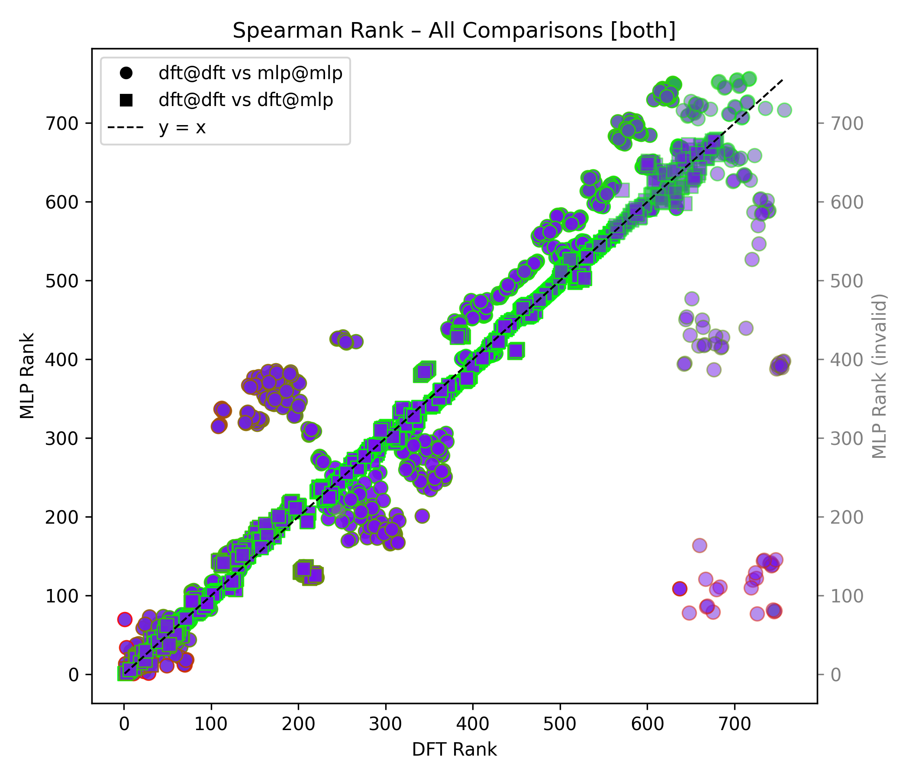
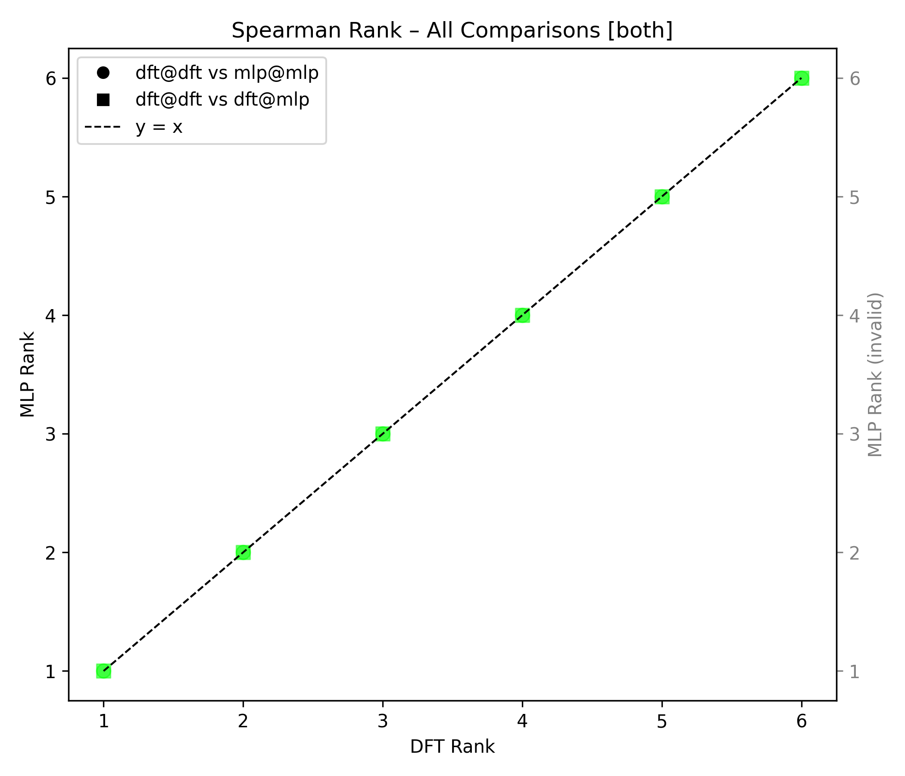
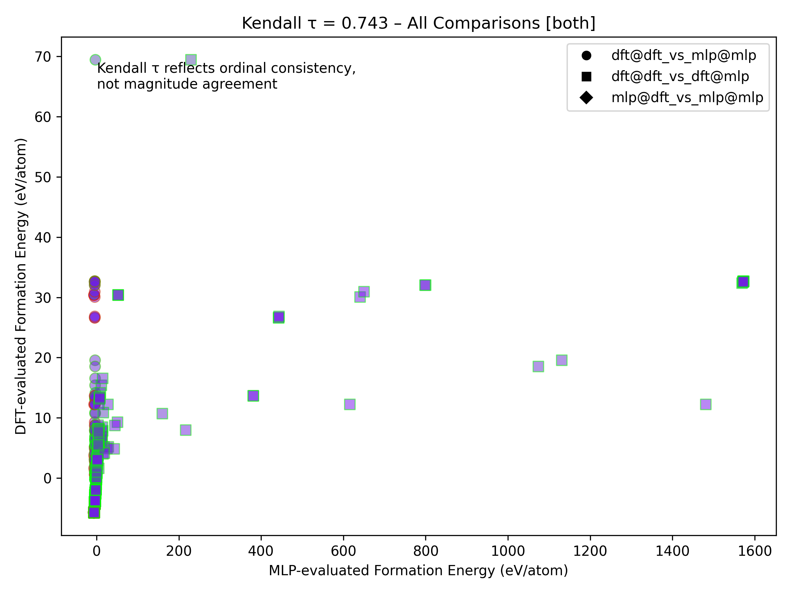
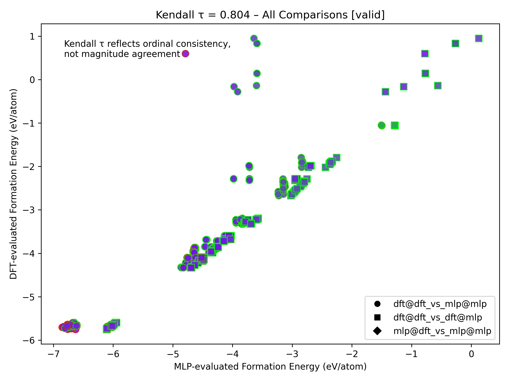
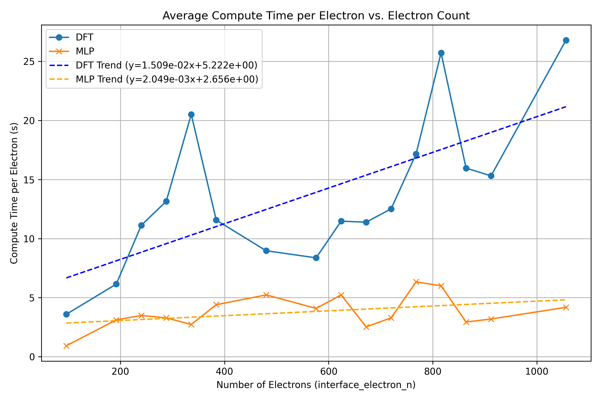

# UPGRADE REPORT

## MPhil Physics to PhD Physics

### By Alexander Paul Holman, June 2025

Download the latest version of the [report](./Upgrade_Report.pdf) or view it on [Overleaf](https://www.overleaf.com/read/xnsnrccwdygt#9901b3).

> if its **** it's because [Amazon Prime](https://www.amazon.co.uk/amazonprime) removed [Baywatch](https://www.imdb.com/title/tt0096542/); so I had to write this up to [Manifest](https://www.imdb.com/title/tt8421350/) like someone who doesn't have access to Baywatch...

Some of the more interesting figures:

#### Top N Overlap

#### Spearman Correlation of All Comparisons

#### Spearman Correlation of Perfect Alloys

#### Kendall Correlation of All Comparisons

#### Kendall Correlation of All "Valid" Comparisons

A note: "valid" here means that the DFT relaxed and computed formation energy is less than 1eV/atom.

#### Compute Time Comparison

